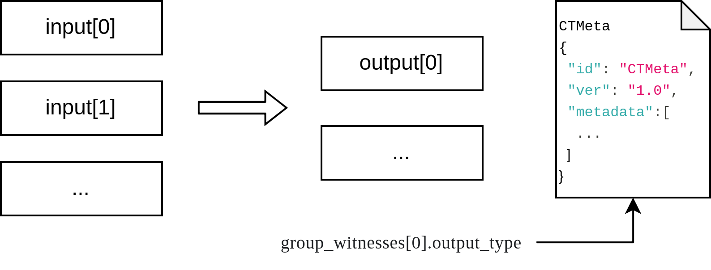

## Introduction

CKB Transaction Metadata (aka. CTMeta) is the standard of additional metadata for transactions, tokens, and smart contracts on Nervos CKB. It dramatically reduces CKB state cost by using witness as the static data storage space. The typical user scenarios of CTMeta include transaction postscript, token definition, NFT description, and so on.



## The convention

CTMeta uses `group_witnesses[0].output_type` as the data container. The data should be written in Json format, with the following schema.

```json
{
	"id": "CTMeta",              // identifier for off-chain processor
    "ver": "1.0",				 // current version
	"metadata":                  
	[
		{
			"target": "output#0",    // description for which utxo, format: {input, output}#index
			"type": "nft-renderer",  // metadata types
            "data": <payload_data>   // detail metadata for various types
        },
		{
			"target": "output#1",	 // an example for transfer postscript
			"type": "postscript",
			"data": "I love you."
		},
		...
	]
}
```

## Pre-defined metadata type

| schema type | description | schema standard |
|--|--|--|
| cota.nft.define* | CoTA NFT definition | [CoTA NFT Metadata Schema](./CTMeta-schemas/nft-schema) |
| cota.ft.define | CoTA FT definition | [CoTA Fungible Token Metadata Schema](./CTMeta-schemas/ft-schema) |
| issuer | cota token issuer information | WIP |
| postscript | general transfer postscript for ckb/sudt/nft | UTF-8 encoded |
| sudt-info | sudt definition | WIP |

\* In previous design, the CoTA NFT definition schema type is `cota`. To keep compatibility, `cota.nft.define` and `cota` will both valid.
