The CoTA (aka. Compact Token Aggregator) protocol is a layer-1.5 **account based fungible / non-fungible token and k-v data managment solution** on Nervos CKB. The basic idea of CoTA is to manage and verify enormous number of data by a Sparse Merkle Tree (SMT) with a constant size of on-chain storage space, like 32bytes. The draft version of the CoTA protocol was published on [Nervos Talk](https://talk.nervos.org/t/rfc-cota-a-compact-token-aggregator-standard-for-extremely-low-cost-nfts-and-fts/6338) at 2021. Since then, the CoTA protocol has evolved rapidly and extended to more user scenarios, including unique CCID, 3rd-party data storage, JoyID, etc. 

## Basic data structure

The CoTA Cell simply consists of two necessary parts, the SMT root in the `cell data` field, and the `CoTA typescript` in the `cell type` field. They stand for the personal data and operation verification logic separately.

## Two-step operation design pattern

One of the major pain points in the application scenarios of [sudt protocol](https://github.com/nervosnetwork/rfcs/blob/master/rfcs/0025-simple-udt/0025-simple-udt.md) is the token transfer operation requires an update to both the sender's and receiver's cell simultaneously. The receiver has to use an [anyone-can-pay](https://github.com/nervosnetwork/rfcs/blob/master/rfcs/0026-anyone-can-pay/0026-anyone-can-pay.md) style lock to their cells, which introduces security risks, composability issues and inconvenient user experiences.

To solve this problem, we introduce a two-step operation design pattern. The principle is simple, the sender first minus token and leaves a proof in their cell, and then the receiver restores the token in their cell according to the mathematical proof. With this method, everyone operates their cells only. And the receiver can immediately confirm the token transfer as soon as the sender completes the first step.

## Decentralized global registry

There should be only one CoTA cell for one address to prevent double-claim issues. Otherwise, multiple CoTA cells with the same address could repeatedly claim tokens according to the same proof. So a [global registry](./cota_registry) must exist to ensure the CoTA cell's uniqueness.

## FT, NFT, and Account model on UTXO chain

CoTA protocol builds in standard token define, mint, and transfer operations, covering fungible and non-fungible tokens. The CoTA cell stores the token issuance, distribution, and holding records under one address. So it's an account model layer over the UTXO model chain, and this feature makes the programming and achieving composability much easier on CKB.
